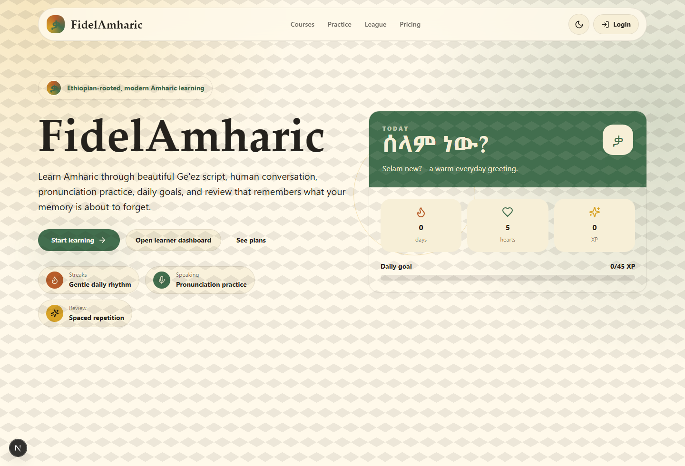
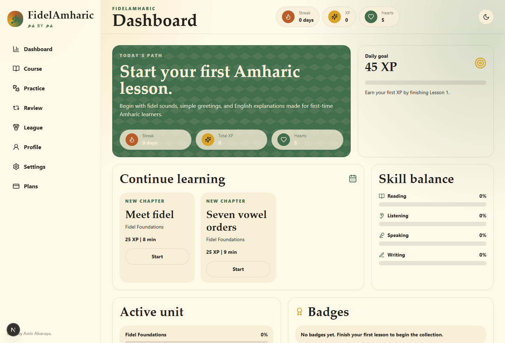
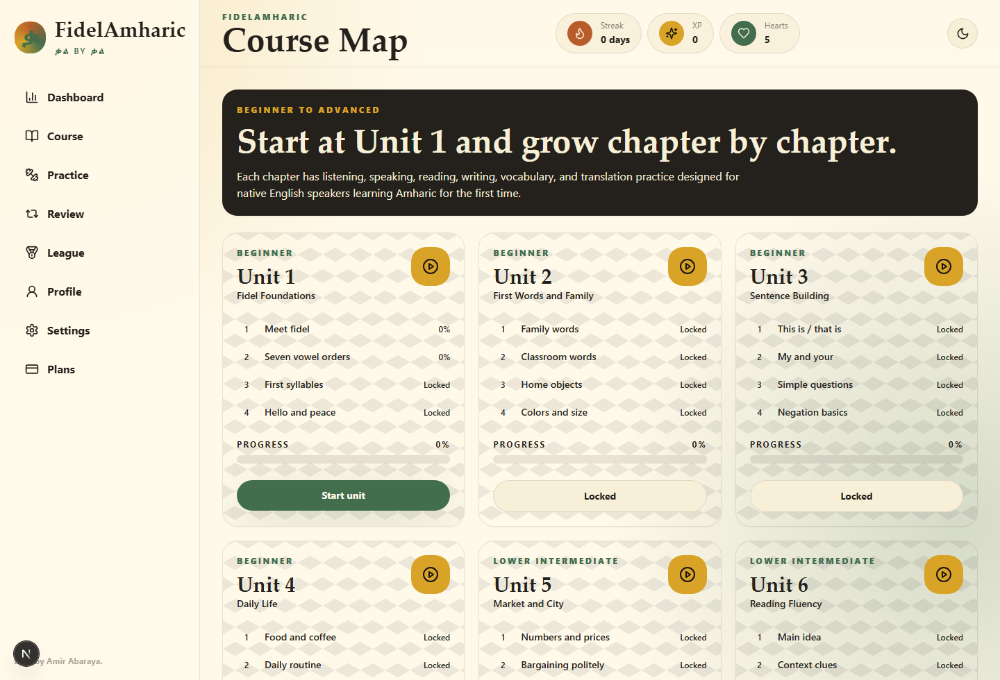
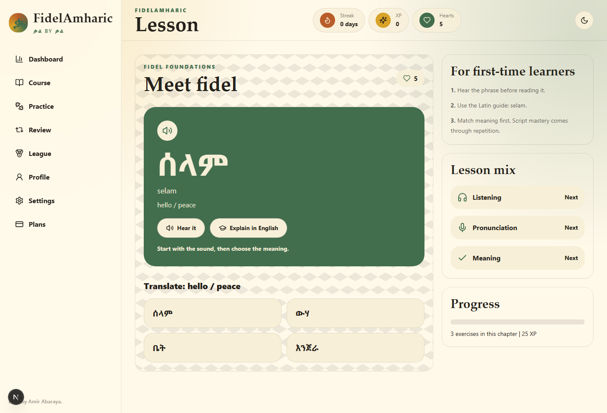
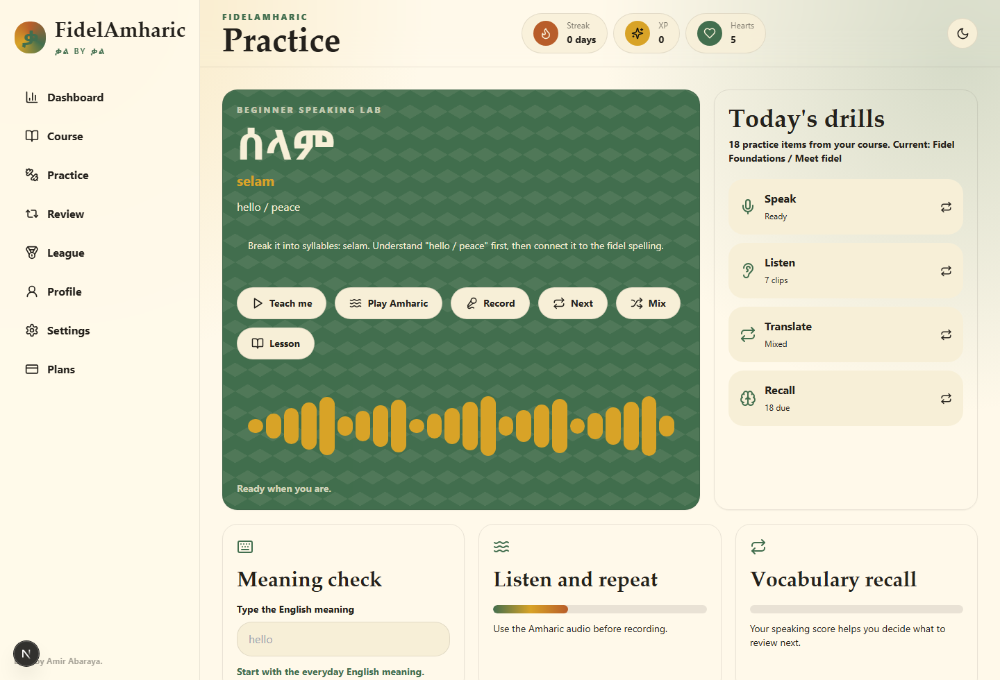
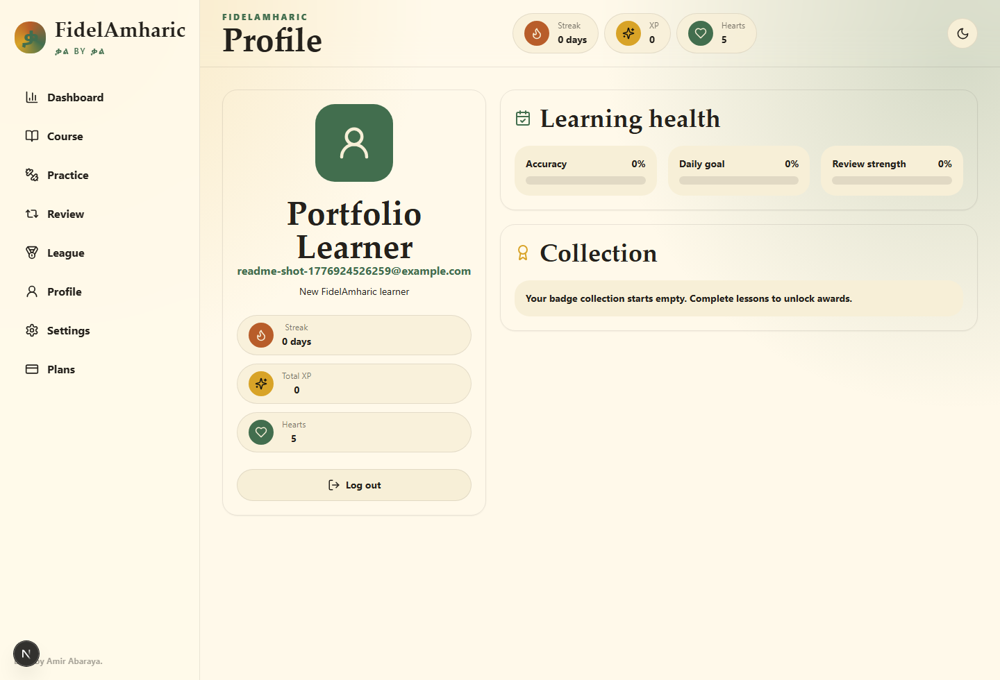

# FidelAmharic

**FidelAmharic** is a premium full-stack Amharic learning platform built by **Amir Abaraya** for native English speakers who are learning Amharic from the very beginning.

The project combines a warm Ethiopian-inspired visual identity with real learner accounts, database-backed course progress, voice practice, gamified lessons, and an admin studio for managing course content, users, plans, and access.

[Live website](https://fidelamharic.vercel.app) · [GitHub repository](https://github.com/amirabaraya/fidelamharic)

## Preview

| Landing | Dashboard |
| --- | --- |
|  |  |

| Course Map | Lesson |
| --- | --- |
|  |  |

| Practice | Profile |
| --- | --- |
|  |  |

## What Makes It Different

FidelAmharic is designed as a serious learning product, not a generic language-app clone. The interface uses soft rounded UI, earthy green, gold, cream, deep charcoal, and subtle cultural patterning inspired by Ethiopian identity and the visual beauty of Ge'ez script.

The learning flow is built for first-time learners: English explanations, Latin pronunciation guides, Amharic script exposure, listening prompts, meaning checks, writing practice, and review loops all work together so a beginner can start with simple sounds and phrases before moving into fuller units.

## Core Features

- Full-stack authentication with learner accounts, admin accounts, and protected app routes
- Database-backed progress so users can continue learning after updates and deployments
- Beginner-friendly Amharic lessons with English-to-Amharic and Amharic-to-English exercises
- XP, streaks, hearts, badges, daily goals, active units, and progress tracking
- Listening, reading, writing, vocabulary drills, flashcards, and spaced repetition surfaces
- Pronunciation practice using browser speech APIs where supported
- Course map with unlocked and locked lesson progression
- Admin content panel for creating, editing, deleting, and rearranging courses, units, and lessons
- Admin user controls for roles, plan access, trials, and subscription status
- Forgot-password flow with verification code support
- Stripe-ready pricing and subscription architecture
- Responsive mobile-first layout, dark mode, keyboard focus states, reduced-motion support, and accessible labels

## Tech Stack

- **Framework:** Next.js App Router
- **Language:** TypeScript
- **UI:** React, Tailwind CSS, Framer Motion, Lucide icons
- **Database:** PostgreSQL with Prisma ORM
- **Authentication:** NextAuth credentials flow with Prisma adapter
- **Payments:** Stripe Checkout and webhook-ready subscription records
- **Deployment:** Vercel

## Product Screens

- `/` Landing page
- `/signup` Sign up
- `/login` Login and password reset entry
- `/dashboard` Learner dashboard
- `/course` Course map
- `/lesson` Interactive lesson page
- `/practice` Practice lab
- `/review` Spaced review
- `/leaderboard` League and XP leaderboard
- `/profile` Learner profile
- `/settings` User settings
- `/pricing` Subscription plans
- `/admin` Admin overview
- `/admin/courses` Admin course studio
- `/admin/users` Admin user and access controls

## Local Review Setup

This repository is shared so recruiters and collaborators can review the implementation. It is not a template or starter kit.

```bash
npm install
cp .env.example .env.local
npm run db:push
npm run db:seed
npm run dev
```

Required environment variables:

```text
DATABASE_URL
NEXTAUTH_URL
NEXTAUTH_SECRET
NEXT_PUBLIC_SITE_URL
STRIPE_SECRET_KEY
STRIPE_WEBHOOK_SECRET
STRIPE_MONTHLY_PRICE_ID
STRIPE_ANNUAL_PRICE_ID
```

## Deployment

Production is deployed on Vercel:

[https://fidelamharic.vercel.app](https://fidelamharic.vercel.app)

The production app expects a hosted PostgreSQL database, NextAuth environment variables, and Stripe keys for paid subscriptions. Database schema changes are managed through Prisma, and sample learning content can be seeded with:

```bash
npm run db:push
npm run db:seed
```

## Ownership

Built by **Amir Abaraya**.

All rights reserved. This source code is published for portfolio review and collaboration only. You may view the code, but copying, redistributing, deploying, selling, or presenting FidelAmharic as your own project is not permitted without written permission from Amir Abaraya.

No open-source license is granted. See [LICENSE](LICENSE).
